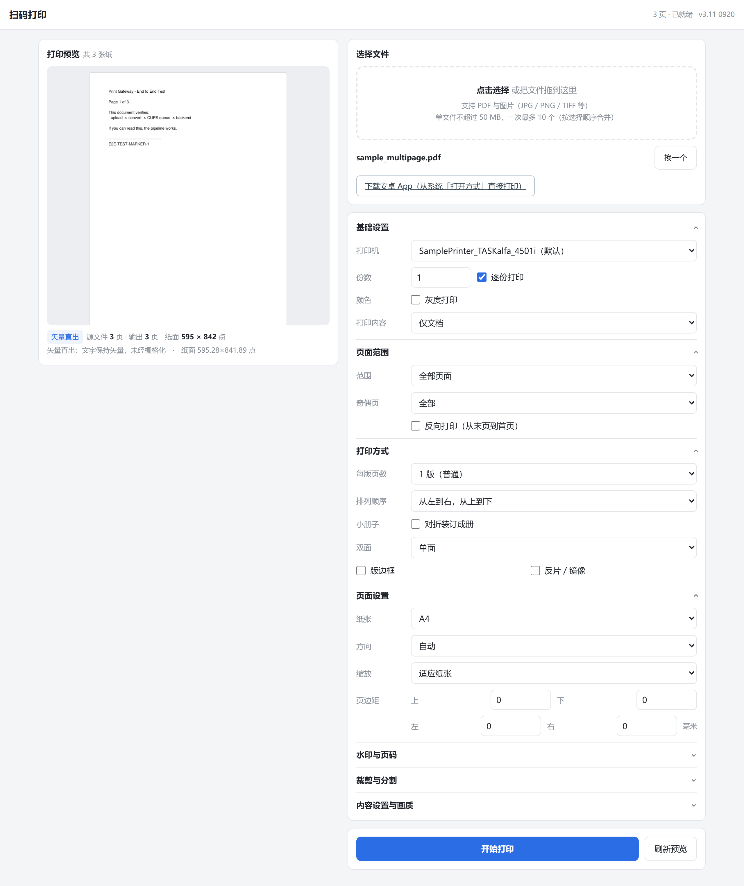
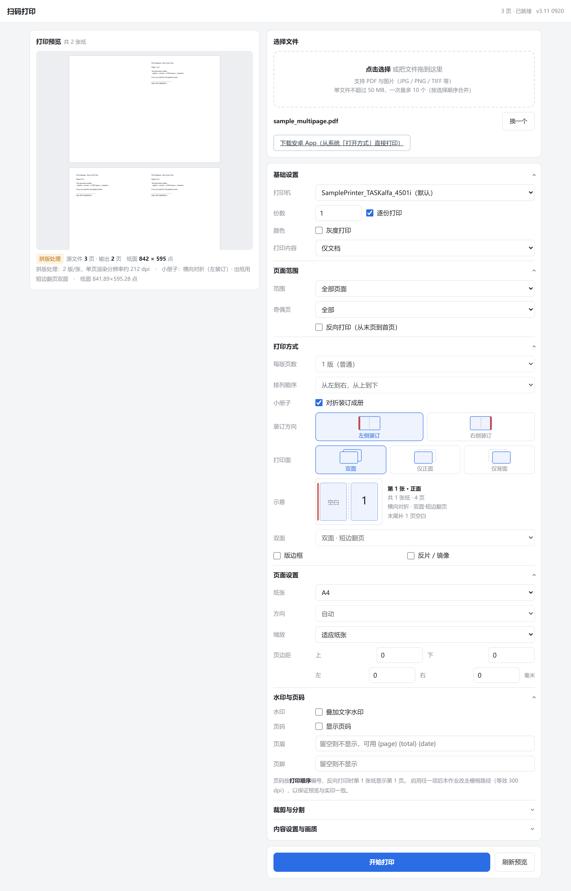
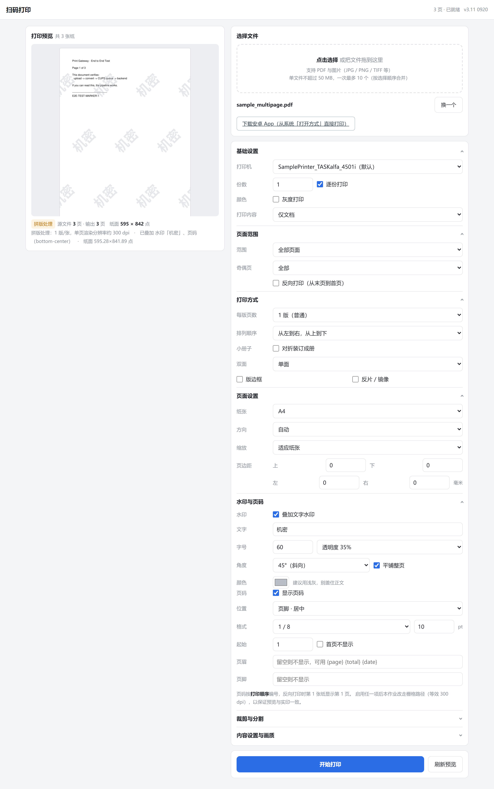
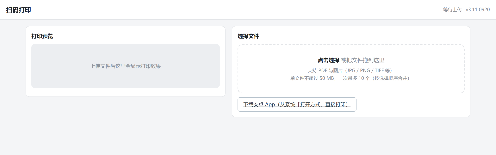

# Print Gateway · 扫码上传打印网关

自建的局域网自助打印服务：**手机扫码 → 上传文件 → 在网页里调好版面 → 从打印机出纸**。

排版引擎全部跑在网关侧（一台 1GB 内存的 armv7 小盒子上），网页只负责采集设置与显示预览。
打印面板对齐 WPS「打印预览」的操作习惯，但**所见即所得是真的** —— 预览与出纸走同一条流水线，
只差构建分辨率。

配套一个安卓 App：WebView 壳 + 相机扫码连接 + 「打开方式」直接打印。

```
手机浏览器 / App ──HTTP(S)──> print_gateway.py ──> 排版引擎 ──> CUPS(lp) ──> 打印机
                              （纯标准库）      （gs/poppler/reportlab/Pillow）
```

| 项 | 值 |
|---|---|
| 语言 / 依赖 | 服务端 Python 3（HTTP 服务仅标准库）；Android Kotlin |
| 实测平台 | Armbian 24.2.1 bookworm / armv7l / 四核 / 988MB 内存 |
| 服务端体积 | 单文件可部署（`print_gateway.py` 覆盖即升级） |
| 单元测试 | 440 项全绿 |
| 部署方式 | 裸机（systemd）或 Docker；也支持只跑网关、连外部 CUPS |

---

## ⚠️ 使用限制：不得用于商用

本项目以 [CC BY-NC 4.0](LICENSE) 许可发布：**仅限非商业用途**（个人自用、学习、开源贡献）。

**禁止**将本代码或其衍生品用于：

- 收费打印服务、共享打印、共享充电宝式的商业投放
- 企业经营性用途，或嵌入任何商业化产品 / 服务
- 以本代码为基础提供有偿技术支持、代部署、代运维

商业使用请自行取得作者许可。

---

## 它解决什么问题

CUPS 2.4.2 自带的 `/printers/<队列>` 页面本身就能上传打印，但在手机上有三个硬伤：

| 问题 | 说明 |
|---|---|
| 手机排版差 | 页面是给桌面浏览器设计的，小屏上控件挤成一团 |
| 每次要输密码 | 上传路径是 `Require user @SYSTEM`，手机会反复弹 Basic Auth |
| 没有版面控制 | 只能填原始 CUPS 选项，没有可视化预览、没有拼版 |

本网关用一个标准库服务包住 CUPS 的 `lp`，做成单页移动端界面，并把**排版工作全部搬到网关侧自己完成**。

---

## 界面

左边是**打印预览**，右边是可折叠的**版面选项**。预览与出纸走同一条流水线，
所以「看起来是这样」和「印出来就是这样」是一回事：



小册子模式会实时给出装订示意 —— 页号取自与实印同一个函数，图不可能和印出来的东西不一致：



水印与页码在栅格层叠加，字号按**纸面 pt** 换算，与拼版缩放、渲染 dpi 都无关：



手机上是同一套页面的响应式布局，扫码进来就能用：


入口页（还没选文件时）：



---

## 特性

### 版面处理

- **每版页数** 1 / 2 / 4 / 6 / 9 / 16 版，四种排列顺序
- **小册子**（骑马订）：自动补白到 4 的倍数，可只打正面 / 只打背面
- **分割（海报打印）** 网格 2×2 / 3×3 / 4×4，每块独占一张纸
- **缩放三模式**：适应纸张（等比）/ 拉伸铺满（允许非等比变形，消除白边）/ 不缩放
- **页边距** 上下左右独立（毫米），**裁剪** 四边独立（单边上限 50mm）
- **双面** 单面 / 长边翻页 / 短边翻页，**镜像（反片）**，**版边框**

### 页面范围与内容

- 页码范围 `1-3,5` / `1-` / 反序 `5-3`，仅奇数页 / 仅偶数页
- **水印**：平铺 / 居中，字号按纸面 pt 换算，可设颜色、透明度、旋转角
- **页码**：六个位置（左中右 × 页眉页脚），四种格式，可设起始页码与首页不显示
- **页眉页脚**：自定义文字，支持 `{page}` / `{total}` / `{date}` 占位符
- **灰度打印**，打印内容可选「文档」或「文档和标记」

### 批量与交互

- 一次上传最多 10 个文件，合并为一个作业，页码跨文件连续
- 改设置后自动重跑预览（防抖 420ms），返回逐页 PNG
- 预览**并行渲染** + 按设置哈希缓存，10 页 A4 约 1.5s（单进程需 3.4s）
- 预览与出纸**分辨率分离**：预览按 144dpi 构建，出纸按 300dpi。10 页小册子预览 20.4s → 7.0s，预览图尺寸不变

### 公网访问（可选）

- 域名 + Let's Encrypt 证书（**DNS-01 验证**，不需要任何入站端口）
- DDNS 定时同步 —— 家宽每天重新拨号也能跟上
- 证书自动续期，`/admin` 管理页录入凭据、一键签发
- 公网端口强制口令，内网扫码免密（二维码装不下口令，这个取舍是刻意的）
- 管理页可把**内网 / 公网 / App 下载**三个连接码排成**贴纸**印出来（1 / 2 / 4 联），
  贴在打印机旁；页面上的预览图可点开放大，方便另一台手机对着屏幕扫

---

## 仓库结构

```
server/            服务端（Python 3，HTTP 服务仅标准库）
  print_gateway.py   网关主程序：HTTP 服务 + 前端 + 上传 + 打印 + TLS + /admin
  pg_engine.py       引擎编排：设置校验 → 选页 → 归一化 → 拼版 → 装饰 → 预览 → 送队列
  pg_layout.py       拼版引擎（纯函数）：网格 / 顺序 / 小册子 / 边距 / 裁剪 / 分割 / 分辨率反算
  pg_decor.py        栅格装饰层：水印 / 页码 / 页眉页脚
  pg_dns.py          DNS 客户端（DNSPod Token 与腾讯云 TC3 两套签名）
  pg_admin.py        管理端支撑：凭据存储与掩码、acme.sh 封装、DDNS 同步、/admin 页面
  pg_ddns.py         定时任务入口（DDNS / 续期 / 状态）
  pg_sticker.py      二维码贴纸：栅格排版（1 / 2 / 4 联）+ 无损 PDF 出纸
  gen_qr.py          纯标准库二维码生成器（SVG / PNG / PBM / 终端）
  setup_printer.py   USB 打印机识别与 CUPS 队列配置
  deploy_gateway.py  一键部署到远端（上传 + 写 unit + 启服务 + 自检）
  gw.ppd             兜底 PPD，供无 PPD 队列使用
  test_backend/      测试用 CUPS 后端，把任务落盘而不真印（无需实体打印机）
  test_*.py          单元测试；verify_*.py 验证脚本

app/               安卓自助打印 App（Kotlin + CameraX + ML Kit）
  WebView 壳 / 相机扫码连接 / 「打开方式」接收 PDF 与图片

docs/screenshots/  README 用的界面截图
Dockerfile         容器镜像：debian bookworm + CUPS + gs + poppler + reportlab + Noto CJK
docker-compose.yml 一条命令跑起来（端口 / 设备直通 / 数据卷 / 健康检查）
docker/            容器支撑：entrypoint.sh（两种模式）+ cupsd.conf（最小 CUPS 配置）
```

---

## 快速开始

### 0. Docker（最快，建议先这样试）

```bash
git clone https://github.com/qq2453539846/print-gateway.git
cd print-gateway
docker compose up -d          # 首次会构建镜像，armv7/arm64/amd64 都能构建
```

然后打开 `http://<这台机器的IP>:8080`。容器里**自带 CUPS**，USB 打印机通过
`devices: /dev/bus/usb` 直通 —— 插上打印机重建一次容器就会被识别到。

常用环境变量（写在 `docker-compose.yml` 的 `environment:` 下）：

| 变量 | 作用 | 默认 |
|---|---|---|
| `PORT` | 网页端口 | `8080` |
| `TITLE` | 页面标题 | `扫码打印` |
| `MAX_MB` | 单文件上传上限（MB） | `50` |
| `ADMIN_TOKEN` | 管理页口令；**留空则 `/admin` 整体关闭** | 空 |
| `HOST_DISPLAY` | 界面上展示的访问地址（多网卡建议显式指定） | 自动探测 |
| `PRINTER` | 锁定默认队列 | 跟随 CUPS 默认 |
| `CUPS_SERVER` | 填了就切到「只跑网关、连宿主 CUPS」模式，容器内不再起 cupsd | 空 |
| `TOKEN` | 公网端口口令 | 空 |
| `PUBLIC_URL` | 内网穿透 / 反向代理的外部地址；**填了必须同时填 `TOKEN`** | 空 |

几件需要知道的事：

- 数据落在 `./data/`（`data/cups` 存队列与 PPD，`data/spool` 存作业）。
  `docker compose down` 不会丢，`down -v` 才会连数据一起清掉。
- 631（IPP）**默认不映射**。想让局域网里其他电脑把这条打印机直接加进去
  （地址填 `<IP>:631`，**不需要装同型驱动**），把 `docker-compose.yml` 里
  `- "631:631"` 那行的注释去掉即可。默认关掉的原因很实际：宿主已经跑着 CUPS 时
  631 被占用，`docker compose up` 会直接失败并报
  `bind: address already in use`，而「宿主有 CUPS」恰恰是本项目最常见的场景 ——
  网关本来就是包着 CUPS 的。那种情况应当改设 `CUPS_SERVER`，让容器别再起第二套 cupsd，
  也就不需要这个映射了。
  无论何时都**绝不能把 631 暴露到公网** —— IPP 提交作业默认免鉴权。
- 想让 iOS / macOS 在「添加打印机」里自动发现队列，需要 mDNS 出容器：
  把 compose 里 `ports:` 整段注释掉，再取消 `network_mode: host` 的注释。
  用不到就别开 —— 扫码打印主流程不依赖自动发现。

---

### 1. 依赖（设备端）

```bash
sudo apt install cups cups-filters ghostscript poppler-utils \
                 python3-reportlab python3-pil fonts-noto-cjk
```

| 用途 | 依赖 |
|---|---|
| 打印系统 | CUPS + cups-filters |
| PDF 归一化 / 栅格化 | `gs`（Ghostscript） |
| 选页合并 / 预览渲染 | `pdftoppm` `pdfinfo` `pdfseparate` `pdfunite`（poppler-utils） |
| 拼版合成 | `python3-reportlab` |
| 位图处理（水印 / 页码） | `python3-pil`（Pillow） |
| 中文水印与页码 | `fonts-noto-cjk`（不装则中文渲染为空白） |

**不需要 pip**：HTTP 服务、DNS 客户端、二维码生成全部只用 Python 标准库。
`reportlab` 与 `Pillow` 走发行版包，避开 armhf 上编译 wheel 的麻烦。

可选：公网 HTTPS 需要 [acme.sh](https://github.com/acmesh-official/acme.sh)。

### 2. 部署

```bash
# 上传服务、写 systemd unit、启动并自检
python deploy_gateway.py --host <你的 SSH 别名> --hostip 192.168.1.100 --port 8080

# 顺带托管 App 下载（网页面板会出现下载按钮）
python deploy_gateway.py --host <别名> --port 8080 --apk /path/to/app-debug.apk

# 带访问口令（网页 / App 连接时需带 ?t=参数）
python deploy_gateway.py --host <别名> --port 8080 --token 你的口令
```

### 3. 没有实体打印机也能试

仓库自带一个落盘后端，把「打印」变成往 `/tmp/gwtest` 写文件：

```bash
# 装后端（一次即可）
install -m 700 test_backend/gwtest /usr/lib/cups/backend/gwtest

# 临时建队列 → 跑端到端 → 删队列
python3 verify_e2e.py --setup --teardown
```

`verify_e2e.py` 用双标记定位法逐项核对页数、尺寸、页序位置、灰度、镜像、
小册子配对、裁剪、分割映射、装饰与批量合并 —— 全部不需要真机。落盘产物
也可以自己拿 PDF 工具看：

```bash
ls -l /tmp/gwtest
```

#### ⚠️ 测试队列不要常驻

手工建删是这两条，`-m raw` **不能省**：

```bash
lpadmin -p GW_TEST -E -v gwtest:/test -m raw    # 建
lpadmin -x GW_TEST                              # 删
```

**为什么不能常驻**：CUPS 会把每个队列都做成 mDNS 实例（`GW_TEST @ <主机名>`），
macOS / Windows 的自动发现列表里就会多出一条看不出区别的条目 —— 它的 TXT 是
`ty=Unknown` / `product=Unknown`，这是唯一能分辨它的破绽。更麻烦的是**网关自己的
网页面板也会列出它**（`list_printers()` 用 `lpstat -p -d` 抓全部队列，前端不过滤），
手滑选中它，作业就落进 `/tmp/gwtest`：**CUPS 报成功、页数也对，就是物理不出纸**。

**为什么 `-m raw` 不能省**：不带 PPD 时 CUPS 只搬运格式、不跑滤镜，落盘的 `.prn`
才是排版引擎的真实产物。省了它，CUPS 会转去「尽力自动配驱动」，观测到的东西就
不可信了 —— 测试等于没测。

后端文件 `gwtest` 自己不广播、不进任何队列列表，留着零副作用。所以
「**后端常驻、队列按需**」是这套组合里最省事的姿势。

### 4. 手机扫码

内网直接用 `http://<设备IP>:8080/`，页面右上角有二维码（`gen_qr.py` 生成，零依赖）。
设了口令就把 `?t=口令` 一起编进码里，App 扫码后自动配好地址与口令。

---

## 架构

```
手机浏览器 ──HTTP──> print_gateway.py (:8080)
                        │
                   ┌────┴──────────────────────────────────────┐
                   │ 排版引擎（pg_engine + pg_layout + pg_decor）│
                   │                                           │
                   │ ① 选页   pdfseparate/pdfunite 按序合并      │
                   │ ② 归一化 ghostscript：纸张/方向/灰度/缩放/   │
                   │          页范围/注释/镜像                   │
                   │ ③ 拼版   reportlab 合成（无损 Flate 嵌入）   │
                   │     ↑ 裁剪/分割在此生效：先算源区域矩形，     │
                   │       再逐块渲染成图，每块只占一页内存        │
                   │ ④ 装饰   pg_decor 在栅格层叠水印/页码/页眉脚  │
                   │ ⑤ 预览   pdftoppm → PNG                     │
                   └────┬──────────────────────────────────────┘
                        │
                    lp -d <队列>（只传份数/逐份/双面/纸张）
                        ▼
                   cupsd → 打印机后端
                        │
                ┌───────┴────────┐
            USB 打印机        gwtest 落盘后端（测试用）
```

### 两条输出路径：矢量直出 vs 栅格拼版

| 条件 | 路径 | 说明 |
|---|---|---|
| 1 版/张、无页边距、无边框、无裁剪/分割/装饰 | **vector** | 纯 Ghostscript 处理，**文字保持矢量**，不栅格化，画质与体积都最优 |
| 多版/张、小册子、有页边距、边框、裁剪、分割、拉伸铺满、水印/页码 | **raster** | 按算出的分辨率把源页渲染成位图再合成到纸面 |

栅格路径的渲染分辨率是**反算**出来的：拼版页数越多、单个版心越小，单页需要的 dpi 越低。

### 三个关键取舍

**为什么自建拼版，不用 CUPS 的 `pdftopdf`**
cups-filters 1.28.17 上实测两个硬伤：`booklet-signature` 直接 SIGABRT 崩溃；无有效 PPD 时会把内容按 Letter 输出（A4 输入变 612×792）。改用 reportlab 自建拼版后行为完全可控 —— 且拼版在网关侧完成后，送 `lp` 时**绝不能再传 `number-up` / `booklet`**，否则被驱动二次拼版。

**为什么用 `http.server` 而不是 Flask / FastAPI**
嵌入式设备上没有 pip，armhf 装包容易失败。纯标准库意味着零安装、升级就是覆盖一个文件。

**为什么水印页码放在栅格层**
Ghostscript 的 `/BeginPage` 等页面钩子对**多页文档只对首页生效**，设备上又没有 `pypdf` 可逐页注入内容流。于是装饰统一在「源页栅格化之后、拼版之前」用 Pillow 叠加，位置与字体完全可控。

### 安全边界

- 文件类型白名单（PDF + 常见图片），拒绝 `.exe/.sh/.php` 等
- 页码范围白名单显式写 `[0-9,\- \t]+`，**刻意不用 `\s`** —— 否则 `1\n2` 能穿透成两页进而注入 `lp` 参数
- 所有枚举值（纸张/方向/顺序/双面/内容）走白名单校验，非法值直接拒绝
- 子进程一律用列表参数调用，不经过 shell
- 所有回显内容 HTML 转义；上传有大小上限与 spool 空间预检
- systemd 单元带 `NoNewPrivileges` / `PrivateTmp` / `ProtectSystem=full`
- 公网端口强制口令，`/admin` 从公网直接 404（fail-closed：解析不出源地址就按公网处理）

---

## 公网访问（域名 + HTTPS）

家用宽带封 80/443 也能做，前提是**证书走 DNS-01 验证**（往 `_acme-challenge` 写 TXT 记录证明域名所有权，不需要任何入站端口）。

### 三条硬约束

| 约束 | 原因 |
|---|---|
| 只能用 TLS 非标端口（如 8443） | 运营商封 80/443；公网入站端口本身通常是通的 |
| 必须 DDNS | PPPoE 每天重新拨号会换 IP，证书绑域名不绑 IP，但域名要跟得上 |
| DNSPod 免费版 TTL 下限 600 秒 | 写下限以下的值 API 会直接拒绝，重拨后最长约 10 分钟解析才收敛 |

### 部署顺序

1. 网关启动加 `--token`（公网端口口令）+ `--admin-token`（管理页口令），两个口令**分开**
2. 装 acme.sh（`--nocron`，续期交给 systemd timer，与 DDNS 统一入口）
3. 在 `/admin` 录入 DNS 凭据 → 「检测凭据」→「签发证书」
4. 证书就绪后网关自动加载，`--tls-port 8443` 开始监听（双栈，显式关 `IPV6_V6ONLY`）
5. 路由器上加端口映射：`wan:8443 → 网关:8443`
6. 装 systemd timer：DDNS 每 60 秒、证书每天检查（剩余 <30 天才续）

### 管理页 `/admin`

内网才可见（公网直接 404）。功能：录凭据、检测凭据、签发/续期、看证书剩余天数、
看当前解析 IP 与上次同步结果、查定时任务状态。

凭据存在设备本地（权限 600），页面**只回显掩码**，永不返回原文。

> **公网地址与内网地址是两条独立分支**。内网 `:8080` 明文免密这条链路自始至终没改过，
> 公网走独立的 `:8443` TLS 分支；不满意就把路由器的端口映射删掉，公网即刻消失。

### 备选：没有公网 IP 时走内网穿透

公网 IP 被运营商收回、或端口彻底封死到 DNAT 用不了时，可以套一层**内网穿透**
（DDNSTO、frp 之类）。思路是把 TLS 挪到隧道边缘，网关这边只跑明文：

```
手机 ──https──> xxxx.ddnsto.com ──隧道──> 内网网关 :8081（带口令）──> CUPS
                └ TLS 在这里终结
```

好处是省掉整套 DNS-01 + acme.sh + 端口映射。代价是**必须额外守三条**：

| # | 要点 | 不守会怎样 |
|---|---|---|
| 1 | 穿透要指向**带 `--token` 的独立实例**（如 8081），绝不能指向内网免密的 8080 | 变成公网免密：谁访问到谁就能上传文件直接打印 |
| 2 | 用 `--public-url` 告诉网关公网入口在哪 | 不配的话公网链接永远是空的，二维码贴纸里的**「公网码」印不出来** |
| 3 | 那个实例**不要设 `--admin-token`** | `/admin` 的「仅限内网」判的是源 IP，而穿透客户端就站在局域网里 ⇒ 公网请求的源 IP 是内网地址 ⇒ 这道关被**反向**绕过，只剩口令一层 |

内网那份照旧不动，另起一个公网实例即可：

```bash
python3 print_gateway.py --port 8081 --token <口令> \
        --spool /var/spool/print-gateway-pub \
        --public-url https://xxxx.ddnsto.com
```

`--public-url` 与 `--tls-port` 是**同一条铁律的两种形态**：只要公网可达就必须有口令，
配了它却漏了 `--token` 会**直接拒绝启动**。配上之后，管理页的「公网链接」与二维码贴纸的
「公网码」都会指向这个地址；漏配 `ADMIN_TOKEN` 时启动日志也会明确告警。

还有两条穿透服务自身的限制要提前知道：

- **只转发 HTTP/HTTPS，不转发裸 TCP** ⇒ IPP（631）过不去。打印主流程不受影响，
  受影响的只有「局域网其他电脑加打印机」，而那条路本来就在局域网内用。
- **首次访问需要微信验证**（按访客 IP 判断），且第三方客户端要先访问一遍域名完成验证，
  否则可能连接失败或假死。这会让「扫码即用」多一道坎，安卓 App 也受影响。

> 如果只是想在蜂窝网下用手机打印、且能装 App，
> **组网方案（Tailscale / ZeroTier）通常比内网穿透更合适** ——
> 组网后设备等同内网，免密与 App 体验都不用让步，也不会撞上上面这三条约束。

---

## HTTP 接口

| 方法 | 路径 | 说明 |
|---|---|---|
| GET | `/` | 打印面板（公开） |
| GET | `/healthz` | 健康检查（含打印机数、TLS 与 App 状态） |
| GET | `/app` | 下载安卓 App 包（`--apk` 指定；放在鉴权之前，扫码用户无口令也能下） |
| POST | `/api/upload` | 上传文件 → 返回作业号、页数 |
| POST | `/api/preview` | 按设置生成最终 PDF 并渲染预览图（JSON body） |
| POST | `/api/print` | 生成最终 PDF 并送 CUPS 队列 |
| GET | `/api/printers` | 打印机列表与默认队列 |
| GET | `/api/job?id=` | 按作业号取回作业（App「打开方式」直达设置页） |
| GET | `/img?job=&k=&n=` | 预览图 |
| GET/POST | `/admin`, `/admin/api/*` | 管理页与接口（仅内网） |

## 命令行参数

| 参数 | 默认 | 说明 |
|---|---|---|
| `--port` | 8080 | 明文端口（内网） |
| `--bind` | 0.0.0.0 | 明文绑定地址 |
| `--printer` | （默认队列） | 指定 CUPS 队列 |
| `--token` | 空 | 公网端口访问口令 |
| `--token-always` | 关 | 内网也要求口令 |
| `--admin-token` | 空 | 管理页口令（不设则 `/admin` 不可用） |
| `--tls-port` | 0 | TLS 端口，0 = 不启用 |
| `--tls-bind` | `::` | TLS 绑定（双栈） |
| `--tls-cert` / `--tls-key` | 空 | 证书与私钥路径 |
| `--public-url` | 空 | 外部可达基地址（内网穿透 / 反向代理用）；**配了它必须配 `--token`** |
| `--spool` | `/var/spool/print-gateway` | 作业目录 |
| `--default-dpi` | 引擎默认 | 出纸渲染 dpi |
| `--max-mb` | 引擎默认 | 单次上传上限 |
| `--host-display` | 空 | 面板上显示的主机名（用于二维码） |
| `--apk` | 空 | 托管下载的 App 包路径 |
| `--title` | 扫码打印 | 页面标题 |
| `--verbose` | 关 | 详细日志 |

---

## 测试

```bash
# 单元测试（440 项）
python3 -m unittest test_pg_engine test_print_gateway test_gen_qr \
                     test_pg_dns test_pg_admin test_pg_ddns test_pg_sticker

# 端到端（打到落盘队列，勿打真机；--setup 建队列、--teardown 跑完删）
python3 verify_e2e.py --setup --teardown

# 只跑标题含某子串的用例（调试用）
python3 verify_e2e.py --only 小册子
```

| 文件 | 覆盖重点 |
|---|---|
| `test_pg_engine.py` | 108 项：注入防护、裁剪/分割/装饰规范化、**预览档不改变版面**、**小册子纸型与双面档位由几何决定** |
| `test_print_gateway.py` | 157 项：合并 PDF、上传上限、multipart 解析、小册子摘要、**预览档与出纸档分槽**、**管理页三道关**、**口令作用范围**、**贴纸生成与三码可用性** |
| `test_pg_sticker.py` | 25 项：版式几何、模块边长取整、**按 marks 逐模块回读比对**、**真实解码器回读**、无中文/坏版式的明确报错 |
| `test_pg_dns.py` | 33 项：公网 / CGNAT 判定、多源兜底、两套 API 读写语义、**「值没变就不发写请求」**、TC3 签名独立复算 |
| `test_pg_admin.py` | 67 项：**掩码不会写成新值**、域名校验、内网判据 fail-closed、证书天数按 UTC 算、DDNS 只碰目标记录 |
| `test_pg_ddns.py` | 14 项：未配置时安静跳过、失败返回非零、`--quiet` 透传 |
| `test_gen_qr.py` | 23 项：矩阵与标准一致性、纠错等级、容量边界 |
| `verify_e2e.py` | 设备端到端：双标记定位法逐项核对页数 / 尺寸 / 页序 / 灰度 / 镜像 / 小册子配对 / 裁剪 / 分割映射 / 装饰 / 批量（`--setup` / `--teardown` 按需建删落盘队列，`--only` 跑子集） |
| `verify_qr.py` | 用 OpenCV 真实解码生成的二维码（需 `opencv-python-headless`） |
| `verify_qr_ref.py` | 与成熟参考库 `qrcode` 的输出**逐位比对**矩阵（需 `qrcode`） |
| `verify_sticker.py` | 设备端贴纸出纸：`pdfinfo` 读回必须是 A4、编码必须是 CCITT G4（无损）、再用 ghostscript 渲一遍 |
| `verify_admin_qr.py` | 管理页二维码闭环：带 Cookie 抓页面 → 取预览图 → 抓 SVG → 还原位图 → **真解码** |
| `verify_img_auth.py` | 外网预览图鉴权：所有图片请求都必须带口令，错一个就整片裂图 |

**一个测试上的取舍值得说明**：断言的写法尽量选「不可能碰巧通过」的判据。
比如验证「预览档不改变版面」时，判据不是「像素差小于某个阈值」，而是
**±1 像素 9 向位移测试** —— 偏移 (0,0) 必须是差异最小的那个。原因是量出来的：
1 像素的版面位移带来的差异（均差 1.33~2.01）和抗锯齿的差异（0.71）是同一量级，
用像素阈值拦住位移只能把阈值压到比正常抖动还低，结果是天天误报。

---

## 已知限制

- **小册子的纸型与双面档位由几何强制**，不听用户选什么：骑马订要求纸面横向、
  翻面轴必须与折线平行（短边翻页）。界面会锁住这两个控件并显示实际取值。
- **预览与出纸分辨率不同**：预览按 144dpi 构建。先预览再打印时那次出纸档构建躲不掉
  （约 18s），只是从预览时刻挪到了打印时刻。
- **DNSPod 免费版 TTL 下限 600 秒** → 家宽重拨后最坏约 10 分钟公网访问不可用。
- **微信小程序不可行**（强制备案域名 + 443），但**微信内置浏览器扫码打开网页可行**。
- acme.sh 只支持 DNS-01 的域名商；HTTP-01 需要 80 端口可用。
- 服务端只测过单列队场景，多队列并发未做压力测试。

---

## 致谢

这个项目站在很多开源项目的肩上。以下按「用在哪」分组，附各自许可。

### 服务端运行时

| 项目 | 在本项目中的角色 | 许可 |
|---|---|---|
| [CUPS](https://github.com/OpenPrinting/cups) | 打印系统本体：队列管理、作业调度、后端驱动 | Apache-2.0 |
| [cups-filters](https://github.com/OpenPrinting/cups-filters) | `pdftopdf` 等 PDF 过滤器链 | GPL-2.0 |
| [usbutils](https://github.com/gregkh/usbutils)（`lsusb`） | `setup_printer.py` 识别 USB 打印机：sysfs 分类不出「是不是打印机」时，读 USB 描述串兜底；也是体检报告的第一段 | GPL-2.0 |
| [kmod](https://github.com/kmod-project/kmod)（`lsmod`）+ [util-linux](https://github.com/util-linux/util-linux)（`dmesg`） | 体检报告：`usblp` 模块有没有加载、内核认没认到这台打印机（只读诊断，读不到不影响功能） | LGPL-2.1 / GPL-2.0 |
| [Ghostscript](https://www.ghostscript.com/) | PDF 解释、纸张/方向/灰度/缩放/镜像归一化、栅格化 | AGPL-3.0 |
| [Poppler](https://poppler.freedesktop.org/)（poppler-utils） | `pdfseparate` / `pdfunite` 选页合并，`pdftoppm` 渲染预览 | GPL-2.0 |
| [ReportLab](https://www.reportlab.com/opensource/) | 拼版 PDF 合成（把每版无损嵌入纸面） | BSD-3-Clause |
| [Pillow](https://python-pillow.org/) | 栅格装饰层：水印、页码、页眉页脚、位图裁剪与合成 | MIT-CMU (HPND) |
| [Python](https://www.python.org/) | 语言与运行时（`http.server`、`ssl`、`zlib`、`ipaddress` 等标准库） | PSF-2.0 |
| [acme.sh](https://github.com/acmesh-official/acme.sh)（可选） | Let's Encrypt 证书签发与续期，含 DNSPod / 腾讯云 DNS 插件 | GPL-3.0 |
| [OpenSSL](https://www.openssl.org/) | `openssl x509` 直读证书到期时间与主题，供 `/admin` 的证书状态显示（不依赖 acme.sh 内部状态文件） | Apache-2.0（3.x） |
| [systemd](https://systemd.io/)（可选） | 服务托管与定时任务（DDNS、证书检查） | LGPL-2.1 |
| [Noto Sans CJK](https://github.com/notofonts/noto-cjk)（`fonts-noto-cjk`） | 中文水印 / 页码 / 页眉页脚的字体 | SIL OFL-1.1 |

证书由 [Let's Encrypt](https://letsencrypt.org/) 免费提供（服务，非代码）。

**公网 IP 探测同理，也是第三方服务**：`pg_dns.py` 的 `WAN_SOURCES` 按「国内可达性」排序，
依次向 `myip.ipip.net`、`ip.3322.net`、`4.ipw.cn`、`api.ipify.org` 四个公开接口 GET 一次
（均无鉴权、限读 512 字节），前一个取不到才试下一个。这些接口的代码不在本仓库，也不受本项目
许可约束；若你的环境不方便让请求外发，把 `WAN_SOURCES` 换成自建接口即可。

**关于 AGPL 的 Ghostscript 会不会「传染」本项目**：不会。本项目通过**子进程**调用 `gs`
命令行（`subprocess` + 参数列表），既不链接其库也不修改其代码，属于独立程序间的调用，
因此本项目仍可沿用 CC BY-NC 4.0。反过来，ReportLab（BSD）与 Pillow（MIT-CMU）虽然是被
`import` 的库，但两者都是宽松许可，允许被更严格的许可再分发 —— 唯一要守的是保留其版权声明。

### Android 端

| 项目 | 用途 | 许可 |
|---|---|---|
| [Kotlin](https://kotlinlang.org/) | App 语言 | Apache-2.0 |
| [AndroidX Core KTX / AppCompat](https://developer.android.com/jetpack/androidx) | 基础库与界面兼容 | Apache-2.0 |
| [CameraX](https://developer.android.com/media/camera/camerax) | 扫码预览（camera2 / lifecycle / view） | Apache-2.0 |
| [Gradle](https://gradle.org/) + [Android Gradle Plugin](https://developer.android.com/build) | 构建系统 | Apache-2.0 |
| [JUnit 4](https://junit.org/junit4/) | Prefs 连接码解析的纯函数单测 | EPL-1.0 |
| **ML Kit Barcode Scanning** | 离线条码识别（扫码连接） | **免费但非开源**（Google 专有 SDK） |

> **关于 ML Kit**：它是 Google 提供的**闭源免费** SDK，不是开源项目，使用需遵守
> Google 的开发者条款（Google APIs Terms of Service 与 ML Kit 相关条款）。
> 本项目的 CC BY-NC 4.0 只覆盖本项目自己的代码，**不覆盖 ML Kit**。
> 如果你更希望全链路开源，可以换用 [ZXing](https://github.com/zxing/zxing)（Apache-2.0），
> 代价是识别率与倾斜 / 模糊场景下的鲁棒性要自己调优。

### 开发、部署与验证工具

| 项目 | 用途 | 许可 |
|---|---|---|
| [python-qrcode](https://github.com/lincolnloop/python-qrcode) | **仅用于对照验证**：`verify_qr_ref.py` 把自研实现与它逐位比对矩阵 | BSD-3-Clause |
| [zxing-cpp](https://github.com/zxing-cpp/zxing-cpp) | **仅用于验证**：`test_pg_sticker.py` 用它做真实解码回读，判定以它为准 | Apache-2.0 |
| [OpenCV](https://opencv.org/) | **仅用于验证**：`verify_qr.py` 用真实解码器回读生成的二维码；`test_pg_sticker.py` 里作补充证据 | Apache-2.0 |
| [NumPy](https://numpy.org/) | 同上，位图数组运算 | BSD-3-Clause |
| [iproute2](https://github.com/iproute2/iproute2)（`ss`） | **仅用于验证**：`test_print_gateway.py` 真起监听后读回内核 `Send-Q`，证明 backlog 不是默认的 5（没装 `ss` 则该用例自动跳过） | GPL-2.0 |
| [OpenSSH](https://www.openssh.com/)（`ssh` / `scp` 客户端） | 部署期：`deploy_gateway.py` 用 `scp` 上传文件、`ssh` 执行安装脚本（走你 `~/.ssh/config` 里的别名） | BSD（OpenSSH 自定义） |
| [Paramiko](https://www.paramiko.org/) | 开发期 SSH 主机指纹采集脚本（未包含在本仓库） | LGPL-2.1 |

> 本项目的二维码生成器（`gen_qr.py`）是**自研的纯标准库实现**，算法依据公开标准
> ISO/IEC 18004，没有拷贝任何第三方实现。`qrcode` 参考库的作用是反向证明 ——
> 如果自研矩阵与成熟库逐位一致，说明位流构造、RS 纠错、块交错、掩码选择全都对。
> 这种「与独立实现比对」的验证方式，比只看二维码「长得像」可靠得多。

> **为什么真解码验证优先用 zxing-cpp 而不是 OpenCV**：OpenCV 的 `QRCodeDetector`
> 有盲区。实测过一个**完全合法**的矩阵 —— payload 只差一个数字，于是标准罚分最优的
> 掩码不同 —— zxing-cpp 读得出，OpenCV 死活读不出（同一矩阵换 8 个掩码里的另外 7 个，
> OpenCV 全都读得出，只有那个读不出）。自研编码器在该数据上的罚分与参考库
> `qrcode.util.lost_point` **逐分完全一致**，也就是说码没有问题，是检测器的问题。
> 若把 OpenCV 当唯一判据，测试会随数据忽红忽绿，还会把人骗去改一个本来正确的编码器。

### 参考标准与规范

- **ISO/IEC 18004** — QR Code 符号规范（纠错码字分配表、掩码罚分规则）
- **RFC 5737 / RFC 3849** — 文档用 IPv4 / IPv6 保留地址（本项目文档中的示例地址）
- **IPP Everywhere / PPD 规范** — `gw.ppd` 兜底 PPD 的编写依据
- **CJK 字体 ttc 索引约定** — Noto Sans CJK 的 `.ttc` 里索引 2 才是简体中文（0 是日文），
  索引是字体文件属性而非常量，写死会导致中文显示成日文字形

### 商标声明

「QR Code」是 [DENSO WAVE INCORPORATED](https://www.denso-wave.com/qrcode/) 的注册商标。
本项目的二维码功能依据公开标准独立实现，与该商标持有者无关联、未获其背书。

---

## 许可

- 代码许可：**CC BY-NC 4.0（仅限非商业用途）**，详见 [LICENSE](LICENSE)
- 保留许可声明与署名：`Copyright (c) 2026 print-gateway authors`
- 再分发时请一并保留本 README 的致谢章节与第三方许可说明
